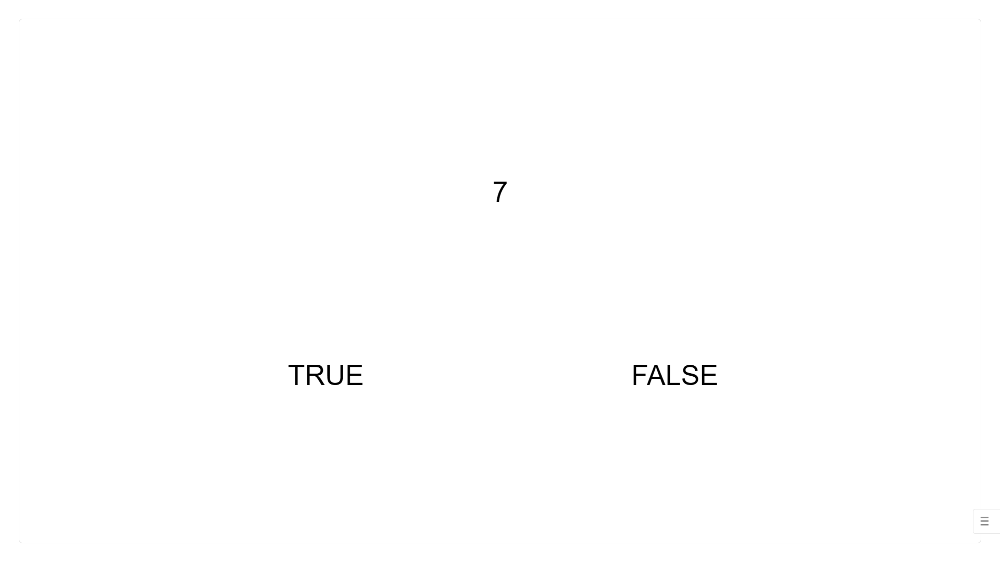

# Operational Span Task for Lab.js

This respository hosts an operational span task, a popular experimental paradigm to measure working memory capacity in cognitive psychology. For online data collection, the task needs to be integrated into Qualtrics. Insert the url: 

https://cogyamaguchi.github.io/OSPAN-Lab.js-/ 

in a sruvey. See the instructions [here](https://labjs.readthedocs.io/en/latest/learn/deploy/3a-qualtrics.html) to learn how you can integrate a Lab.js experiment into a Qualtrics survey. Data will be saved as survey responses (see below for details of the data structure).

The task is created based on Foster et al. (2014). 

> Note that Foster et al. adjusted response deadline for the math problems for each participant according to the average response time on practice trials, but the current task does not impose any response deadline.

### **References**
Foster, J. L., Shipstead, Z., Harrison, T. L., Hicks, K. L., Redick, T. S., & Engle, R. W. (2014). Shortened complex span tasks can reliably measure working memory capacity. *Memory & Cognition*, *43*, 226-236.

## **Task Parameters and Structure**

### **OSPAN task**
The task consists of simple letter span and arithmetic problems. **The letter span task** includes 12 possible letters (F,H,J,K,L,N,P,Q,R,S,T,Y) for the letter span task. On each trial, randomly selected letters are presented sequentially one after another, and participants are to report the letters in the correct order. Participants are provided with the following display to enter their answers by clicking letters:

 
**The arithmetic problem** is presented in the form (3 * 2) + 1, where the numbers are quasi-randomly selected on each trial. The first term is selected from a following pre-set set: 

["(2/1)", "(3/1)", "(4/1)", "(4/2)", "(5/1)", "(6/1)", "(6/2)", "(6/3)", "(7/1)", "(8/1)", "(8/2)", "(8/4)", "(9/1)", "(9/3)", "(1\*2)", "(1\*3)", "(2\*2)", "(1\*4)", "(1\*5)", "(3\*2)", "(2\*3)", "(1\*6)", "(1\*7)", "(4\*2)", "(2\*4)", "(1\*8)", "(3\*3)", "(1\*9)", "(5\*2)", "(2\*5)", "(6\*2)", "(4\*3)", "(3\*4)", "(2\*6)", "(7\*2)", "(2\*7)", "(5\*3)", "(3\*5)", "(8\*2)"]

The second term is a single interger that is also selected quasi-randomly from [-9,9], such that the result will be greater than zero. Participants are then presented with a test item on the next display and judge whether the number is the same as the correct answer to the arithmetic problem. They will click 'TRUE' or 'FALSE.' When the correct answer is 'FALSE', the test item is generated by adding a random number in a range [-4,4] with the constraint that the result is greater than zero. Participants are allowed 5 seconds at most to make the judgment.

**The OSPAN task** combines the letter span and the arithmetic problem. Participants are first provided with an arithmetic problem as described above, and a letter is presented as they click 'TRUE' or 'FALSE.' The sequence of the two tasks continues for a given set size, and participants are presented with the letter entry display as shown above.

### **Practice Phase**
The experiment consists of three practice blocks and one test block. The first practice block includes 4 trials of the letter span task. The first two trials are of a letter set size of 2, and the last two trials are of a letter set size of 3. The second practice block inclues 15 trials of the arithmetic problems. The third practice block is the OSPAN task where the letter span and arithmetic problem are combined. There are three trials of a letter set size of 2. Feedback to participants' responses are given in the first practice blocks, in terms of a message "Correct" or "Error." There is no feedback in the third practice block.

The test block is essentially the same as the third practice block, except that it consists of 15 trials of letter set sizes [3,4,5,6,7]. Each set size is presented in an ascending order and for three trials per set size. In total, participants are required to remember 75 letters.

## **Partial and Absolute Scores**
The data file will include 'partial score (OSPAN)' and 'absolute score' for the letter span task. For the partial score, each entry of a letter gains a point only if both letter identity and position is correct. Thus, the maximum partial score is 75. For the absolulte score, a point is givne only if all letters are reported in the correct order for a given trial. Thus, the maximum absolute score is 15. The partial score is typically considered as OSPAN.

